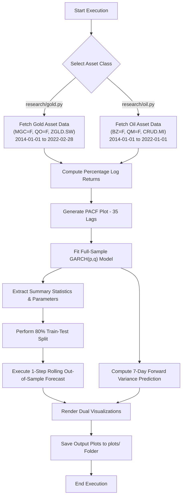
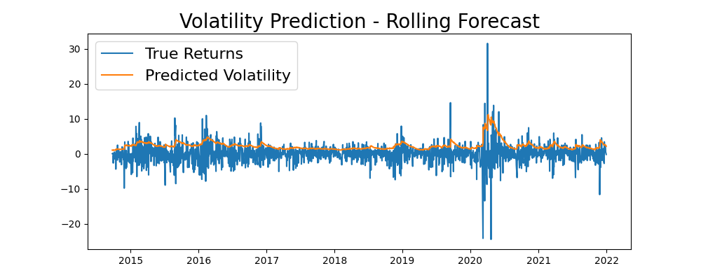

# Volatility Prediction of Oil and Gold Prices Using GARCH Model

[](#publication--links)
[](https://papers.ssrn.com/sol3/papers.cfm?abstract_id=7323778)
[](#publication--links)

## Authors
* Piyush Kumar
* Divyansh Sagar
* Lakhwinder Kaur Dhillon

---

## Publication & Links
* **Journal:** Indian Journal of Natural Sciences (Volume 14, Issue 82, Pages 514–524, 2024)
* **SSRN Preprint:** [View Paper on SSRN](https://papers.ssrn.com/sol3/papers.cfm?abstract_id=7323778)
* **Google Scholar:** [View Citation](https://scholar.google.com/citations?view_op=view_citation&hl=en&user=GwEBOKYAAAAJ&citation_for_view=GwEBOKYAAAAJ:UeHWp8X0CEIC)
* **ResearchGate:** [Download Full PDF](https://www.researchgate.net/profile/Piyush-Kumar-178/publication/379992851_Volatility_Prediction_of_Oil_and_Gold_Prices_Using_GARCH_Model/links/662604ad39e7641c0be0b728/Volatility-Prediction-of-Oil-and-Gold-Prices-Using-GARCH-Model.pdf)

---

## Repository Structure

```text
.
├── research/
│   ├── gold.py          # Gold futures/ETFs data fetching, GARCH modeling & forecasting
│   └── oil.py           # Oil futures/ETFs data fetching, GARCH modeling & forecasting
├── plots/
│   ├── gold/            # Generated PACF and GARCH volatility charts for Gold assets
│   └── oil/             # Generated PACF and GARCH volatility charts for Oil assets
└── README.md            # Comprehensive project documentation
```

## Abstract
This study constructs GARCH/ARCH time-series models to predict future price volatility on a rolling basis for energy commodities and precious metals to aid risk management decisions. Financial data spanning from **August 2014 to February 2022** was extracted from Yahoo Finance. Dynamic GARCH models were implemented in Python across various oil and gold futures/ETFs to identify optimal volatility prediction models with lower error rates.

---
## Architecture Overview

The system processes financial time-series data to quantify dynamic volatility across precious metals and energy commodities using generalized autoregressive conditional heteroskedasticity (GARCH) frameworks.


---

## System Flowchart



## System Dependencies

### Prerequisites
* Python 3.8+

### Required Python Libraries
Install all required libraries via pip:
* ```pip install arch yfinance statsmodels pandas numpy matplotlib```

## Application Execution Flow
When executing the analysis scripts, the runtime follows these steps:
1. Load asset-specific GARCH $(p, q)$ parameters and target date ranges.
2.  Download Adjusted Close / Close prices via yfinance and computes percentage daily returns:
  $$R_t = \left(\frac{P_t - P_{t-1}}{P_{t-1}}\right) \times 100$$
3. Plot PACF across 35 lags to verify conditional heteroskedasticity structure.
4. Fit the specified GARCH $(p,q)$ model using constant mean and normal error distribution:
  $$\sigma_t^2 = \omega + \sum_{i=1}^p \alpha_i \epsilon_{t-i}^2 + \sum_{j=1}^q \beta_j \sigma_{t-j}^2$$
5. Train on 80% of historical data, sequentially forecasting 1-step-ahead conditional volatility across the remaining 20% test period.
6. Predict conditional variance over the next 7 trading days from the full model.
7. Display comparative charts combining true return distributions, rolling predicted volatility, and 7-day forecast trajectories.

### Running the Scripts
* Gold Volatility Execution:
  
```python research/gold.py```

* Oil Volatility Execution:
  
```python research/oil.py```

## Optimal Model Configurations & Results

| Asset Category | Financial Instrument | Ticker Symbol | Best Performing Model |
| :--- | :--- | :--- | :--- |
| **Oil / Energy** | Brent Oil Futures | `BZ=F` | GARCH(1, 2) |
| **Oil / Energy** | E-Mini Crude Oil Futures | `QM=F` | GARCH(1, 0) |
| **Oil / Energy** | WisdomTree WTI Crude Oil | `CRUD.MI` | GARCH(1, 1) |
| **Gold / Metals** | Micro Gold Futures | `MGC=F` | GARCH(1, 0) |
| **Gold / Metals** | E-Mini Gold Futures | `QO=F` | GARCH(1, 2) |
| **Gold / Metals** | ZKB Gold ETF | `ZGLD.SW` | GARCH(1, 1) |

---

## Visualizations Gallery

Selected GARCH volatility forecasts and 7-day rolling evaluations:

| Oil Volatility Forecasts | Gold Volatility Forecasts |
| :---: | :---: |
|  | .png) |


---

## Citation

If you find this research or dataset useful, please cite our paper:

**APA / Plain Text:**
> Kumar, Piyush and Sagar, Divyansh and Dhillon, Lakhwinder, Volatility Prediction of Oil and Gold Prices Using GARCH Model (December 02, 2023). Available at SSRN: https://ssrn.com/abstract=7323778 or http://dx.doi.org/10.2139/ssrn.7323778

**BibTeX (SSRN Preprint):**
```bibtex
@article{kumar2023volatility_ssrn,
  title={Volatility Prediction of Oil and Gold Prices Using GARCH Model},
  author={Kumar, Piyush and Sagar, Divyansh and Dhillon, Lakhwinder Kaur},
  journal={SSRN Electronic Journal},
  year={2023},
  month={12},
  doi={10.2139/ssrn.7323778},
  url={[https://ssrn.com/abstract=7323778](https://ssrn.com/abstract=7323778)}
}
